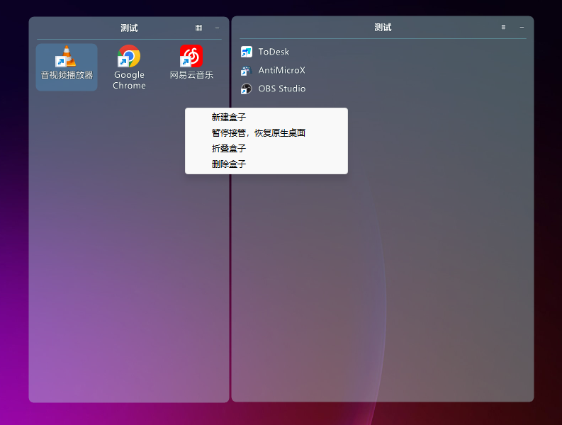

# nestlone-desktop

**nestlone-D** 是一个 Windows 桌面收纳工具：读取真实桌面路径和系统图标，在桌面层绘制可折叠的自有盒子视图。文件不会被移动到应用目录，盒子只保存路径归属和显示布局。



*上图为旧版外观参考。当前源码正在切换为酷呆式自有盒子视图。*

> 当前架构处于实验阶段。自动排列、权限差异、Explorer 重启和多显示器环境的限制见下文。

## 功能

- 高透、清新的赛璐璐风格盒子；可调整背景色与背景透明度，文字与图标保持清晰。
- 图标由 Explorer 的 `SysListView32` 绘制和交互，程序不复制或遮罩图标。
- 拖动标题栏移动背景与已收纳图标，拖动右下角手柄缩放背景；双击标题原地重命名盒子。
- 自有盒子内支持图标点击、双击打开、拖动排版和 Shell 右键菜单委托；路径仍保持原位置。
- 标题栏“▦”整理图标位置，标题栏右键可收纳矩形内已有图标。
- 托盘菜单提供显示切换、新建盒子、设置与退出入口。
- 启动、隐藏、删除盒子和退出均保留真实图标；收起背景时图标也保持可见。
- 应用程序与托盘均使用内嵌的透明图标资源。

## 环境要求

- Windows 10 或 Windows 11
- Visual Studio Build Tools，包含 MSVC C++ 桌面工具与 Windows SDK（`cl.exe`、`rc.exe`）

不依赖第三方运行时或包管理器。

## 构建

在“x64 Native Tools Command Prompt for Visual Studio”或普通 `cmd` / PowerShell 中执行：

```bat
build.bat
```

默认输出为 `build\nestlone-D.exe`。指定输出目录和文件名：

```bat
build.bat release nestlone-D.exe
```

运行生成的 `nestlone-D.exe` 后，可从系统托盘打开菜单。

## 发布版本

推送以 `v` 开头的 Git 标签会触发 GitHub Actions，在 Windows x64 Runner 上重新编译并创建 / 更新同名 GitHub Release。Release 附件包含单独的 `nestlone-D.exe` 与 `nestlone-D-windows-x64.zip`。

```bat
git tag v0.1.0
git push origin v0.1.0
```

工作流需要仓库的 Actions `GITHUB_TOKEN` 拥有 **Contents: read and write** 权限。详情见 [.github/workflows/release.yml](.github/workflows/release.yml)。

## 使用方式

1. 通过托盘菜单新建一个盒子。
2. 拖动盒子的顶部栏移动位置；拖动右下角手柄调整背景大小。
3. 顶部栏按钮依次为整理图标位置、收起 / 展开背景、删除盒子。
4. 双击盒子标题，在原位置直接输入新名称；按 Enter 或点击别处保存，按 Esc 取消。
5. 像平时使用桌面一样，将图标拖入背景矩形；程序观察位置变化后记录归属。拖出矩形即解除归属。右键图标仍打开 Windows 自己的菜单。
6. 已在矩形内但没有移动过的图标，可通过标题栏右键“收纳区域内图标”加入。启动时不会自动搬动桌面图标。

## 安全边界与已知限制

nestlone-D 不移动文件、不改写隐藏属性、不修改壁纸、不改变“自动排列”或其他全局桌面选项。背景是图标下方的输入透明分层窗口，只有标题栏和角落手柄接收装饰层输入。位置规则使用 `LVM_SETITEMPOSITION`，通过 Shell 读取结果校验。

- 关闭桌面“自动排列图标”后才能应用位置规则；程序不代为更改此选项。
- UIPI 会限制跨权限定位，程序应与 Explorer 使用相同权限运行。
- 当前自有视图已支持按盒子折叠隐藏图标；完整复刻 Explorer 的框选、键盘导航和无障碍行为仍在补齐。
- 框选仍作用于整个桌面，不受背景矩形限制。盒子不能提供独立滚动区域。
- Explorer 重启后重建背景与标题栏；图标由 Explorer 自行恢复，程序不在重连时强制重排。

该机制仍属实验性功能：非默认图标间距、特殊桌面视图模式和混合 DPI 多显示器尚需更多人工验证。完整设计与验证范围见 [docs/DESKTOP-INTEGRATION.md](docs/DESKTOP-INTEGRATION.md)。

## 测试

```bat
tests\render\run.bat
tests\hosting\session.bat
```

- `render`：背景透明度、折叠状态与“不绘制任何图标”回归测试。
- `hosting`：自有图标表面、Explorer 原生列表隐藏/恢复、Z 序、路径和布局不变测试，使用专用临时布局。
- 可选真实定位测试：`tests\hosting\session.bat --position-test`，仅移动已有专用测试目录 `DeskBox-hosting-test-20260914`，随后恢复其原位置。默认测试不移动用户图标。

## 目录结构

```text
assets/     应用与托盘图标资源
docs/       设计说明与已知限制
src/        Win32 C++ 源码与资源脚本
tests/      当前维护的渲染和桌面交互测试
build.bat   一键构建脚本
```

## License

本项目采用 [MIT License](LICENSE)。

## Credit

First introduced on the [LINUX DO](https://linux.do/) community — thanks to everyone there for the first round of discussion.
